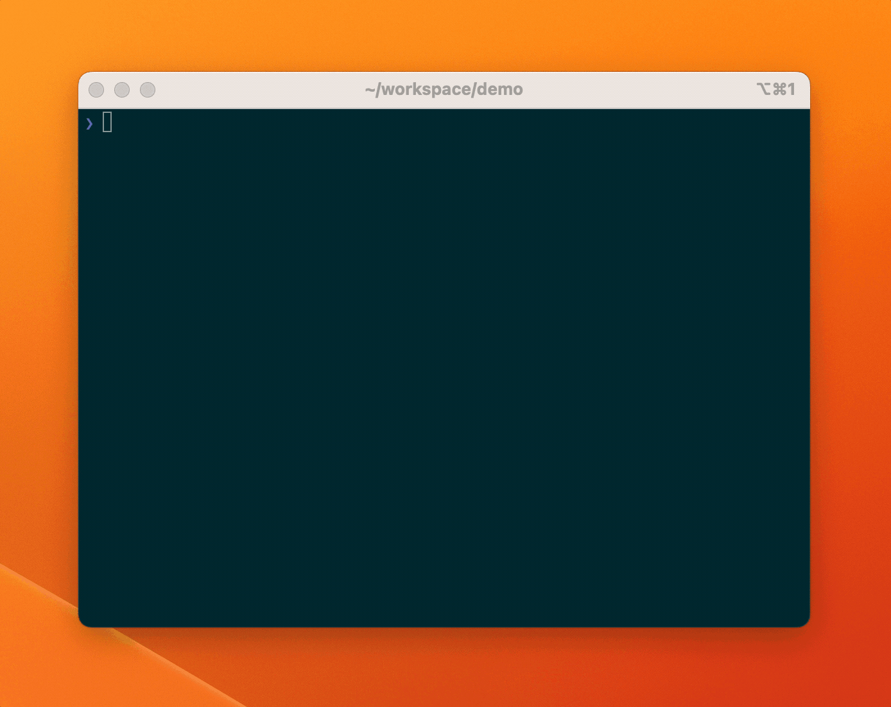

# anchor-wrapper

`anchor-wrapper` is a command-line tool for generating and managing Solana Anchor projects. It wraps the Anchor CLI and provides additional functionality to streamline the development process.



## Installation

To install `anchor-wrapper`, run the following command:

```bash
sudo /bin/bash -c "$(curl -fsSL https://raw.githubusercontent.com/hieuphq/sol-anchor/main/install.sh)"
```

This will download and install the latest version of anchor-wrapper. You can replace v0.1 with the specific version you want to install.

## Usage

To create a new Anchor project using anchor-wrapper, run the following command:

```
anchor-wrapper my-project hieuphq/sol-anchor:v0.1
```

This will create a new Anchor project in a directory called my-project. anchor-wrapper will prompt you for additional information, such as the project name and ID.

Once you have initialized your project, you can use the ./anchor.sh commands to manage it. Here are some examples:

```
# Generate TypeScript code from your Anchor IDL file
./anchor.sh generate

# Build your Anchor project
./anchor.sh build

# Deploy your Anchor program to the Solana network
./anchor.sh deploy

# Run the Anchor tests
./anchor.sh test
```

For a complete list of commands and options, run anchor-wrapper --help.
## License

This project is licensed under the MIT License - see the LICENSE file for details.
```
In this example, the `Installation` section includes a command to install `anchor-wrapper`, which downloads and installs the latest version of the tool. The `Usage` section includes examples of how to use `anchor-wrapper` commands to generate, build, deploy, and test an Anchor project.
```
